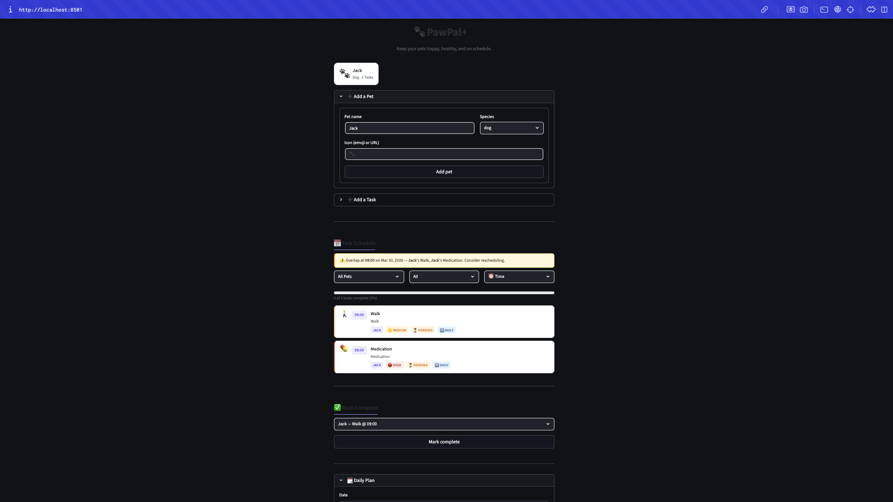

# PawPal+ (Module 2 Project)

You are building **PawPal+**, a Streamlit app that helps a pet owner plan care tasks for their pet.

## Scenario

A busy pet owner needs help staying consistent with pet care. They want an assistant that can:

- Track pet care tasks (walks, feeding, meds, enrichment, grooming, etc.)
- Consider constraints (time available, priority, owner preferences)
- Produce a daily plan and explain why it chose that plan

Your job is to design the system first (UML), then implement the logic in Python, then connect it to the Streamlit UI.

## What you will build

Your final app should:

- Let a user enter basic owner + pet info
- Let a user add/edit tasks (duration + priority at minimum)
- Generate a daily schedule/plan based on constraints and priorities
- Display the plan clearly (and ideally explain the reasoning)
- Include tests for the most important scheduling behaviors

### Features
- **Chronological task ordering** — `Scheduler.sort_by_time()` orders tasks by `occurrence_date` and clock time (`HH:MM`); tasks without a time window are listed after timed tasks on the same day.
- **Filtering** — `filter_tasks()` narrows lists by **pet name**, **completion status** (pending vs. done), or both, so views stay focused in the UI and in code.
- **Same-time conflict detection** — `detect_conflicts()` groups tasks that share the **same date and exact time string** and surfaces them for warnings (see *Smarter Scheduling* for scope).
- **Recurring tasks** — Tasks with `frequency` `"daily"` or `"weekly"` can be completed through `mark_task_complete()`, which marks the instance done and appends **one** next occurrence to the same pet (via `timedelta`).
- **Daily plan generation** — `generate_daily_plan(date)` builds a day’s plan from tasks due that date, ordered by **priority** (high → medium → low), then date and time; `explain_plan()` returns a readable summary.
- **Streamlit app** — Add pets and tasks, see filtered/sorted schedules, conflict alerts, mark tasks complete (including recurrence), and generate a daily plan for a chosen date.
- **CLI demo** — `main.py` prints unsorted vs. sorted tasks, conflict groups, filter examples, and recurring completion in the terminal.

### Demo
Insert Screenshot here
<a href="/course_images/ai110/demo.png" target="_blank"></a>

## Smarter Scheduling

The `Scheduler` in `pawpal_system.py` adds a lightweight **algorithmic layer** on top of tasks and pets:

- **Sort by time** — `sort_by_time(tasks)` orders tasks by `occurrence_date` and clock time (`HH:MM`), using Python’s `sorted()` with a clear key.
- **Filter tasks** — `filter_tasks(tasks, completed=..., pet_name=...)` narrows the list by completion status, pet name, or both together.
- **Recurring care** — When a task with `frequency` `"daily"` or `"weekly"` is completed via `mark_task_complete`, the next occurrence is created with `timedelta` and attached to the same pet (one step at a time, no infinite pre-generation).
- **Conflict hints** — `detect_conflicts(tasks)` finds two or more tasks on the **same day at the same exact time** and returns groups for warnings (simple exact-match check, not full duration overlap).

Run `python3 main.py` to see a terminal demo: unsorted vs sorted lists, filters, conflict output, and recurring completion.

## Getting started

### Setup

```bash
python -m venv .venv
source .venv/bin/activate  # Windows: .venv\Scripts\activate
pip install -r requirements.txt
```

### Suggested workflow

1. Read the scenario carefully and identify requirements and edge cases.
2. Draft a UML diagram (classes, attributes, methods, relationships).
3. Convert UML into Python class stubs (no logic yet).
4. Implement scheduling logic in small increments.
5. Add tests to verify key behaviors.
6. Connect your logic to the Streamlit UI in `app.py`.
7. Refine UML so it matches what you actually built.

## Testing PawPal+

Automated tests in `tests/test_pawpal.py` exercise the core domain logic: task completion and pet task lists; chronological sorting (`sort_by_time`); daily and weekly recurrence after `mark_task_complete`; conflict detection for duplicate date/time slots; filtering by pet name and completion status; and edge cases such as pets with no tasks and daily task filtering by date.

From the project root (with your virtual environment activated):

```bash
python -m pytest
```

**Reliability confidence:** ★★★★☆ (4/5) — Core scheduling and data-model behavior is covered by pytest; the Streamlit UI and full integration paths are not automated here.
