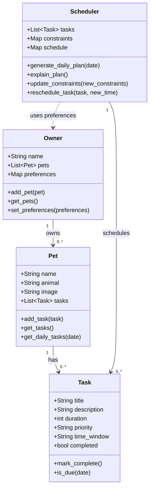

# PawPal+ Project Reflection

## 1. System Design

**a. Initial design**

- Briefly describe your initial UML design.
Three core actions that a user should be able to do with PawPal+ are:
- Add their pet(s) to a dashboard, to be able to manage their pets. This will allow the user to see basic info about the pet such as name, maybe picture, animal, etc.
- Within the space for a given pet, the user should be able to view a simple overview of tasks related to the care for that pet, ideally for a specified timeframe (likely on a daily cadence). Could possibly have a calendar for less frequent tasks such as doctor check-up so the option to still view it is there but the default and also a good MVP feature is just on a day-to-day basis
- The user should be able to add care tasks, we can start with a simple walk. Can maybe proceed to have different types of tasks, such as grooming, health checkups, medication reminder, feeding, etc.

- What classes did you include, and what responsibilities did you assign to each?
Here are the main objects needed for the system and an outline of their attributes and methods:

### 1. Pet
**Attributes:**
- `name`: The pet's name
- `animal`: The type/species of pet (e.g., dog, cat)
- `image`: A photo or avatar representing the pet
- `tasks`: List of care tasks assigned to this pet

**Methods:**
- `add_task(task)`: Assign a new task to this pet
- `get_tasks()`: Retrieve all tasks for this pet
- `get_daily_tasks(date)`: Get tasks specific to a certain day

---

### 2. Task
**Attributes:**
- `title`: Name of the task (e.g., "Walk")
- `description`: Details about the task
- `duration`: Estimated time needed to complete the task (e.g., in minutes)
- `priority`: How important the task is (e.g., high/medium/low, or numeric)
- `time_window`: Preferred or scheduled time for task (optional)
- `completed`: Whether the task has been completed

**Methods:**
- `mark_complete()`: Set the task as done
- `is_due(date)`: Check if the task is due on a given date

---

### 3. Owner
**Attributes:**
- `name`: The owner's name
- `pets`: List of pets owned by the user
- `preferences`: Preferences or constraints (e.g., available time, preferred routines)

**Methods:**
- `add_pet(pet)`: Add a new pet to the owner profile
- `get_pets()`: Retrieve a list of all owned pets
- `set_preferences(preferences)`: Update owner scheduling or task preferences

---

### 4. Scheduler
**Attributes:**
- `tasks`: All tasks needing to be scheduled (could be across pets)
- `constraints`: Any scheduling constraints (e.g., owner's time limits, pet needs)
- `schedule`: The computed plan for the day

**Methods:**
- `generate_daily_plan(date)`: Create a prioritized and feasible set of tasks for the given day, considering constraints and priorities
- `explain_plan()`: Provide a rationale or explanation for the generated schedule
- `update_constraints(new_constraints)`: Modify scheduling parameters (e.g., owner's available time)
- `reschedule_task(task, new_time)`: Change the timing of a given task

---

### Mermaid Class Diagram

**b. Design changes**

- Did your design change during implementation?
- If yes, describe at least one change and why you made it.

---

## 2. Scheduling Logic and Tradeoffs

**a. Constraints and priorities**

- What constraints does your scheduler consider (for example: time, priority, preferences)?
- How did you decide which constraints mattered most?

**b. Tradeoffs**

- Describe one tradeoff your scheduler makes.
- Why is that tradeoff reasonable for this scenario?

---

## 3. AI Collaboration

**a. How you used AI**

- How did you use AI tools during this project (for example: design brainstorming, debugging, refactoring)?
- What kinds of prompts or questions were most helpful?

**b. Judgment and verification**

- Describe one moment where you did not accept an AI suggestion as-is.
- How did you evaluate or verify what the AI suggested?

---

## 4. Testing and Verification

**a. What you tested**

- What behaviors did you test?
- Why were these tests important?

**b. Confidence**

- How confident are you that your scheduler works correctly?
- What edge cases would you test next if you had more time?

---

## 5. Reflection

**a. What went well**

- What part of this project are you most satisfied with?

**b. What you would improve**

- If you had another iteration, what would you improve or redesign?

**c. Key takeaway**

- What is one important thing you learned about designing systems or working with AI on this project?
