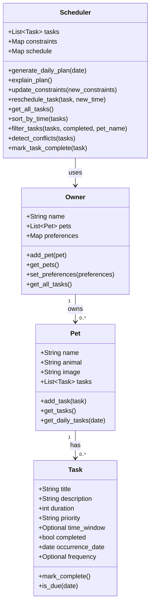

# PawPal+ Project Reflection

## 1. System Design

**a. Initial design**

- Briefly describe your initial UML design.
Three core actions that a user should be able to do with PawPal+ are:
- Add their pet(s) to a dashboard, to be able to manage their pets. This will allow the user to see basic info about the pet such as name, maybe picture, animal, etc.
- Within the space for a given pet, the user should be able to view a simple overview of tasks related to the care for that pet, ideally for a specified timeframe (likely on a daily cadence). Could possibly have a calendar for less frequent tasks such as doctor check-up so the option to still view it is there but the default and also a good MVP feature is just on a day-to-day basis
- The user should be able to add care tasks, we can start with a simple walk. Can maybe proceed to have different types of tasks, such as grooming, health checkups, medication reminder, feeding, etc.

- What classes did you include, and what responsibilities did you assign to each?
Here are the main objects needed for the system and an outline of their attributes and methods:

### 1. Pet
**Attributes:**
- `name`: The pet's name
- `animal`: The type/species of pet (e.g., dog, cat)
- `image`: A photo or avatar representing the pet
- `tasks`: List of care tasks assigned to this pet

**Methods:**
- `add_task(task)`: Assign a new task to this pet
- `get_tasks()`: Retrieve all tasks for this pet
- `get_daily_tasks(date)`: Get tasks specific to a certain day

---

### 2. Task
**Attributes:**
- `title`: Name of the task (e.g., "Walk")
- `description`: Details about the task
- `duration`: Estimated time needed to complete the task (e.g., in minutes)
- `priority`: How important the task is (e.g., high/medium/low, or numeric)
- `time_window`: Preferred or scheduled time for task (optional)
- `completed`: Whether the task has been completed

**Methods:**
- `mark_complete()`: Set the task as done
- `is_due(date)`: Check if the task is due on a given date

---

### 3. Owner
**Attributes:**
- `name`: The owner's name
- `pets`: List of pets owned by the user
- `preferences`: Preferences or constraints (e.g., available time, preferred routines)

**Methods:**
- `add_pet(pet)`: Add a new pet to the owner profile
- `get_pets()`: Retrieve a list of all owned pets
- `set_preferences(preferences)`: Update owner scheduling or task preferences

---

### 4. Scheduler
**Attributes:**
- `tasks`: All tasks needing to be scheduled (could be across pets)
- `constraints`: Any scheduling constraints (e.g., owner's time limits, pet needs)
- `schedule`: The computed plan for the day

**Methods:**
- `generate_daily_plan(date)`: Create a prioritized and feasible set of tasks for the given day, considering constraints and priorities
- `explain_plan()`: Provide a rationale or explanation for the generated schedule
- `update_constraints(new_constraints)`: Modify scheduling parameters (e.g., owner's available time)
- `reschedule_task(task, new_time)`: Change the timing of a given task

---

### Mermaid Class Diagram

**b. Design changes**

- Did your design change during implementation?

Yes. A few details evolved once the classes were implemented in code.

- If yes, describe at least one change and why you made it.

The clearest change is on **Task**. The original UML lists `time_window`, `mark_complete`, and `is_due(date)`, but it does not say how a single task object should represent “this walk on *this* day” versus the same walk on another day. To make `get_daily_tasks(date)` and conflict detection (same day + same time) well-defined, each task instance now carries an **`occurrence_date`**. For **recurring** care (daily or weekly), the implementation also adds an optional **`frequency`** field. When a recurring task is marked complete, the scheduler creates a *new* `Task` with the next date instead of overloading one row for every day. That keeps the UML’s `Task` fields for title, duration, and priority, while making scheduling and recurrence behavior testable and predictable.

A smaller structural change: **`Scheduler.tasks`** in code is not a separate list you edit by hand; it is derived from the **Owner** (all tasks on all pets), which matches the idea that the scheduler works across pets but avoids duplicating data in two places. **`Owner.get_all_tasks()`** was added as a convenience for that aggregation even though it was not on the first UML diagram.

---

## 2. Scheduling Logic and Tradeoffs

**a. Constraints and priorities**

- What constraints does your scheduler consider (for example: time, priority, preferences)?
- How did you decide which constraints mattered most?

The scheduler works with several kinds of information, but not all of them are enforced the same way.

**What it considers**

- **Calendar / “what is due today”:** `generate_daily_plan(on_date)` only pulls tasks whose `occurrence_date` matches that day (`Pet.get_daily_tasks` / `Task.is_due`), so the plan is scoped to a single calendar date.
- **Priority:** The daily plan is **ordered by priority first** (high before medium before low via `_priority_rank`), then by date, then by `time_window`. So for “what to do first today,” **priority is the main ordering rule** inside that day’s list.
- **Time:** `sort_by_time` orders tasks by `occurrence_date` and clock time (`HH:MM`). That is the natural order for a timeline view and for spotting same-slot issues.
- **Owner preferences and generic constraints:** `Owner.preferences` and `Scheduler.constraints` are **stored** and copied into the generated `schedule` dict so they travel with the plan, but they **do not automatically reorder or block** tasks in code. They are hooks for a richer scheduler later (for example, “only morning walks”).
- **Completion and pet:** Filtering by `completed` and `pet_name` helps views and demos; it does not change the core sort order of the daily plan.

**What mattered most and why**

For this assignment, **priority first** in `generate_daily_plan` matches the idea that urgent care (medication, high-priority items) should appear before lower-priority chores when you read the plan. **Date and time** matter next so the list still feels chronological after priority is applied. I did **not** try to encode every real-world constraint (travel time, pet anxiety, weather) because that would overshoot a lightweight class project; keeping preferences and constraints as **data** keeps the design honest: the structure is there even if the engine does not optimize on it yet.

**b. Tradeoffs**

- Describe one tradeoff your scheduler makes.
**Tradeoff: exact-time conflict detection vs. overlap-by-duration**

`detect_conflicts` groups tasks by **same calendar day and same `time_window` string** (exact match, e.g. two tasks both at `"09:00"`). It does **not** look at whether two tasks’ **time intervals** overlap (for example, a 45-minute task starting at 08:45 and a 30-minute task at 09:00).

- Why is that tradeoff reasonable for this scenario?
That tradeoff is reasonable here because the app models tasks with a **single scheduled time** and a duration mainly for display, not for interval math. Exact matching is easy to explain, test, and debug, and it catches the clearest user mistakes (double-booking the same slot). Full overlap detection would need start + duration converted to real time ranges and more edge-case handling for little benefit in a small demo. If PawPal grew into a product with long blocks of care, I would revisit this and treat each task as a `[start, start + duration)` interval on a timeline.

---

## 3. AI Collaboration

**a. How you used AI**

- How did you use AI tools during this project (for example: design brainstorming, debugging, refactoring)?
I used AI mainly to **move faster on structure and wording** without replacing my own judgment on correctness. Early on, it helped brainstorm **class responsibilities** (Owner, Pet, Task, Scheduler) and **Mermaid syntax** for the class diagram so I could iterate on the UML before writing code. During implementation, I used it for **small refactors** (for example keeping `Task` as a dataclass with clear fields) and for **stubbing Streamlit forms** in `app.py` in a consistent pattern. When something felt off, I asked **targeted “why” questions**—for example how to represent recurring care without breaking the original UML—and then implemented the version that matched the tests and the README scenario.

- What kinds of prompts or questions were most helpful?
The prompts that worked best were **grounded in files or constraints**: “Given this `Scheduler` API, how should `mark_task_complete` attach the next occurrence?” and “List edge cases for `detect_conflicts` assuming exact `time_window` strings.” Vague “write the whole app” requests were less useful because they skipped tradeoffs I still had to own (see §2 and the design changes in §1b).

**b. Judgment and verification**

- Describe one moment where you did not accept an AI suggestion as-is.
One concrete moment: an early suggestion was to treat **conflicts** as overlapping intervals using **duration** (e.g. a 45-minute block vs a 30-minute block). That would be a valid product direction, but this codebase intentionally uses **same day + same `time_window` string** for `detect_conflicts`, and the README describes that as a simple exact-match rule. I kept the **exact-match** behavior because it matches the assignment’s “lightweight scheduler” scope, is easy to reason about in `pawpal_system.py`, and is fully covered by tests like `test_detect_conflicts_flags_duplicate_times` and `test_detect_conflicts_ignores_tasks_without_time_window`.

- How did you evaluate or verify what the AI suggested?
I verified the AI’s ideas by **running `python -m pytest`**, reading failures against the intended behavior, and checking that **`main.py`**’s terminal demo still matched what we claim in the README (sort, filter, conflicts, recurrence). If a suggestion did not line up with those checks or with the documented tradeoff in §2b, I did not merge it.

---

## 4. Testing and Verification

**a. What you tested**

- What behaviors did you test?
Automated tests in `tests/test_pawpal.py` focus on the **domain and scheduler**, not the Streamlit layer. They cover:

    - **Task and Pet basics:** `mark_complete` toggles completion; `add_task` updates the pet’s list as expected.
    - **`sort_by_time`:** Chronological order by `occurrence_date` and `HH:MM`, including tasks **without** a `time_window` sorting last within a day, and ordering **across multiple dates**.
    - **Recurrence via `mark_task_complete`:** Daily tasks get a **next-day** instance; weekly tasks get a **next-week** instance; one-off tasks do **not** spawn a follow-up task.
    - **`detect_conflicts`:** Flags groups when two tasks share the **same date and same time string**; no false positives when times differ; tasks with **no** `time_window` are ignored for conflict grouping (as designed).
    - **`filter_tasks`:** Filtering by **pet name** and by **completion** status on a multi-pet owner fixture.
    - **Robustness and daily views:** Scheduler still works when a pet has **no** tasks; `get_daily_tasks` returns only tasks for the requested **calendar date**.

- Why were these tests important?
These tests matter because they guard the **behaviors the README promises** (smarter scheduling: sort, filter, recurrence, conflict hints) and because bugs there would silently wrong-foot users in both **`main.py`** demos and **`app.py`**, even though the UI itself is not exercised by pytest.

**b. Confidence**

- How confident are you that your scheduler works correctly?
I am **reasonably confident** (on the order of **four out of five**) that the scheduler logic behaves as specified for the paths above, because those paths are explicitly tested. Confidence is **not** maximal mainly because **Streamlit** (`app.py`) is not under automated tests—session state, form validation, and “generate plan for this date” flows are verified by **manual** runs.

- What edge cases would you test next if you had more time?
If I had more time, I would add tests for **`generate_daily_plan` / `explain_plan`** (priority ordering vs pure time sort, and that explanations mention the right fields), **invalid `HH:MM` input** at the UI boundary, and **integration-style** checks that completing a task in a full Owner graph updates the correct pet’s task list. Optional stretch: property-based tests for recurrence dates or fuzzing time strings.

---

## 5. Reflection

**a. What went well**

- What part of this project are you most satisfied with?

I am most satisfied with the **clear split between model and scheduler**: `Task`, `Pet`, and `Owner` stay readable, and `Scheduler` adds **`sort_by_time`**, **`filter_tasks`**, **`detect_conflicts`**, and **`mark_task_complete`** recurrence without duplicating pet data (tasks aggregate from `Owner.get_all_tasks()`). That made **`main.py`** a convincing demo and gave **`tests/test_pawpal.py`** a stable surface to lock in behavior. The **UML + reflection alignment** (occurrence dates, frequency, exact-time conflicts) also makes the write-up honest about what the code actually does.

**b. What you would improve**

- If you had another iteration, what would you improve or redesign?

I would **automate at least one UI smoke test** (e.g. Streamlit’s testing utilities or a thin wrapper around session actions) so refactors to `app.py` are safer. I would also **either implement preference-driven ordering** or narrow the UI copy so it does not imply constraints reorder tasks until they do. For scheduling, I might add **interval overlap** as an optional mode or **timezone-aware** dates if this were a real product.

**c. Key takeaway**

- What is one important thing you learned about designing systems or working with AI on this project?

**Design is a contract between diagrams, code, and tests.** When those three disagree, the tests and runnable demos should win—and AI is most useful when it helps you implement and document that contract quickly, not when it overrides it. Keeping **small, testable rules** (exact time conflicts, explicit recurrence) made PawPal+ shippable for a class scope while leaving a credible path to a richer scheduler later.
