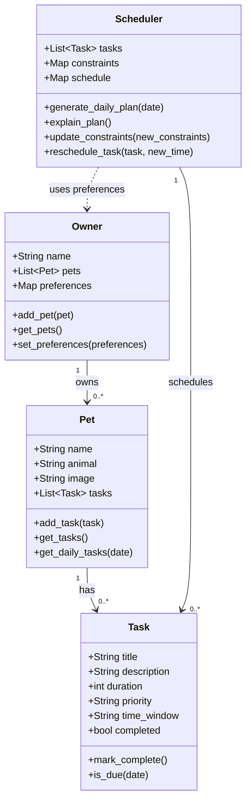

# PawPal+ Project Reflection

## 1. System Design

**a. Initial design**

- Briefly describe your initial UML design.
Three core actions that a user should be able to do with PawPal+ are:
- Add their pet(s) to a dashboard, to be able to manage their pets. This will allow the user to see basic info about the pet such as name, maybe picture, animal, etc.
- Within the space for a given pet, the user should be able to view a simple overview of tasks related to the care for that pet, ideally for a specified timeframe (likely on a daily cadence). Could possibly have a calendar for less frequent tasks such as doctor check-up so the option to still view it is there but the default and also a good MVP feature is just on a day-to-day basis
- The user should be able to add care tasks, we can start with a simple walk. Can maybe proceed to have different types of tasks, such as grooming, health checkups, medication reminder, feeding, etc.

- What classes did you include, and what responsibilities did you assign to each?
Here are the main objects needed for the system and an outline of their attributes and methods:

### 1. Pet
**Attributes:**
- `name`: The pet's name
- `animal`: The type/species of pet (e.g., dog, cat)
- `image`: A photo or avatar representing the pet
- `tasks`: List of care tasks assigned to this pet

**Methods:**
- `add_task(task)`: Assign a new task to this pet
- `get_tasks()`: Retrieve all tasks for this pet
- `get_daily_tasks(date)`: Get tasks specific to a certain day

---

### 2. Task
**Attributes:**
- `title`: Name of the task (e.g., "Walk")
- `description`: Details about the task
- `duration`: Estimated time needed to complete the task (e.g., in minutes)
- `priority`: How important the task is (e.g., high/medium/low, or numeric)
- `time_window`: Preferred or scheduled time for task (optional)
- `completed`: Whether the task has been completed

**Methods:**
- `mark_complete()`: Set the task as done
- `is_due(date)`: Check if the task is due on a given date

---

### 3. Owner
**Attributes:**
- `name`: The owner's name
- `pets`: List of pets owned by the user
- `preferences`: Preferences or constraints (e.g., available time, preferred routines)

**Methods:**
- `add_pet(pet)`: Add a new pet to the owner profile
- `get_pets()`: Retrieve a list of all owned pets
- `set_preferences(preferences)`: Update owner scheduling or task preferences

---

### 4. Scheduler
**Attributes:**
- `tasks`: All tasks needing to be scheduled (could be across pets)
- `constraints`: Any scheduling constraints (e.g., owner's time limits, pet needs)
- `schedule`: The computed plan for the day

**Methods:**
- `generate_daily_plan(date)`: Create a prioritized and feasible set of tasks for the given day, considering constraints and priorities
- `explain_plan()`: Provide a rationale or explanation for the generated schedule
- `update_constraints(new_constraints)`: Modify scheduling parameters (e.g., owner's available time)
- `reschedule_task(task, new_time)`: Change the timing of a given task

---

### Mermaid Class Diagram

**b. Design changes**

- Did your design change during implementation?

Yes. A few details evolved once the classes were implemented in code.

- If yes, describe at least one change and why you made it.

The clearest change is on **Task**. The original UML lists `time_window`, `mark_complete`, and `is_due(date)`, but it does not say how a single task object should represent “this walk on *this* day” versus the same walk on another day. To make `get_daily_tasks(date)` and conflict detection (same day + same time) well-defined, each task instance now carries an **`occurrence_date`**. For **recurring** care (daily or weekly), the implementation also adds an optional **`frequency`** field. When a recurring task is marked complete, the scheduler creates a *new* `Task` with the next date instead of overloading one row for every day. That keeps the UML’s `Task` fields for title, duration, and priority, while making scheduling and recurrence behavior testable and predictable.

A smaller structural change: **`Scheduler.tasks`** in code is not a separate list you edit by hand; it is derived from the **Owner** (all tasks on all pets), which matches the idea that the scheduler works across pets but avoids duplicating data in two places. **`Owner.get_all_tasks()`** was added as a convenience for that aggregation even though it was not on the first UML diagram.

---

## 2. Scheduling Logic and Tradeoffs

**a. Constraints and priorities**

- What constraints does your scheduler consider (for example: time, priority, preferences)?
- How did you decide which constraints mattered most?

The scheduler works with several kinds of information, but not all of them are enforced the same way.

**What it considers**

- **Calendar / “what is due today”:** `generate_daily_plan(on_date)` only pulls tasks whose `occurrence_date` matches that day (`Pet.get_daily_tasks` / `Task.is_due`), so the plan is scoped to a single calendar date.
- **Priority:** The daily plan is **ordered by priority first** (high before medium before low via `_priority_rank`), then by date, then by `time_window`. So for “what to do first today,” **priority is the main ordering rule** inside that day’s list.
- **Time:** `sort_by_time` orders tasks by `occurrence_date` and clock time (`HH:MM`). That is the natural order for a timeline view and for spotting same-slot issues.
- **Owner preferences and generic constraints:** `Owner.preferences` and `Scheduler.constraints` are **stored** and copied into the generated `schedule` dict so they travel with the plan, but they **do not automatically reorder or block** tasks in code. They are hooks for a richer scheduler later (for example, “only morning walks”).
- **Completion and pet:** Filtering by `completed` and `pet_name` helps views and demos; it does not change the core sort order of the daily plan.

**What mattered most and why**

For this assignment, **priority first** in `generate_daily_plan` matches the idea that urgent care (medication, high-priority items) should appear before lower-priority chores when you read the plan. **Date and time** matter next so the list still feels chronological after priority is applied. I did **not** try to encode every real-world constraint (travel time, pet anxiety, weather) because that would overshoot a lightweight class project; keeping preferences and constraints as **data** keeps the design honest: the structure is there even if the engine does not optimize on it yet.

**b. Tradeoffs**

- Describe one tradeoff your scheduler makes.
- Why is that tradeoff reasonable for this scenario?

**Tradeoff: exact-time conflict detection vs. overlap-by-duration**

`detect_conflicts` groups tasks by **same calendar day and same `time_window` string** (exact match, e.g. two tasks both at `"09:00"`). It does **not** look at whether two tasks’ **time intervals** overlap (for example, a 45-minute task starting at 08:45 and a 30-minute task at 09:00).

That tradeoff is reasonable here because the app models tasks with a **single scheduled time** and a duration mainly for display, not for interval math. Exact matching is easy to explain, test, and debug, and it catches the clearest user mistakes (double-booking the same slot). Full overlap detection would need start + duration converted to real time ranges and more edge-case handling for little benefit in a small demo. If PawPal grew into a product with long blocks of care, I would revisit this and treat each task as a `[start, start + duration)` interval on a timeline.

---

## 3. AI Collaboration

**a. How you used AI**

- How did you use AI tools during this project (for example: design brainstorming, debugging, refactoring)?
- What kinds of prompts or questions were most helpful?

**b. Judgment and verification**

- Describe one moment where you did not accept an AI suggestion as-is.
- How did you evaluate or verify what the AI suggested?

---

## 4. Testing and Verification

**a. What you tested**

- What behaviors did you test?
- Why were these tests important?

**b. Confidence**

- How confident are you that your scheduler works correctly?
- What edge cases would you test next if you had more time?

---

## 5. Reflection

**a. What went well**

- What part of this project are you most satisfied with?

**b. What you would improve**

- If you had another iteration, what would you improve or redesign?

**c. Key takeaway**

- What is one important thing you learned about designing systems or working with AI on this project?
